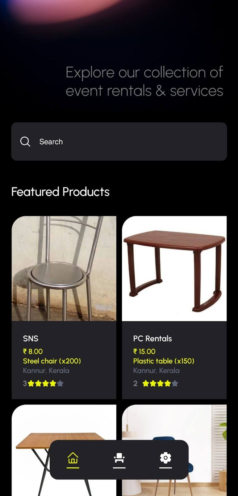

# GalaGrid: Backend

APK Available at Front End repository: https://github.com/MZaFaRM/GalaGrid

GalaGrid is an event rental prototype app that simulates the entire process of renting goods for events. Developed using React Native for the frontend and Django for the backend, the app is designed to streamline the event rental process, providing users with a seamless experience.

## Features

-   **Event Rental Simulation**: Users can browse and rent various items for events.
-   **Admin Panel**: Manage users, rental items, and orders via a robust admin panel built with Django.
-   **Real-Time Updates**: The app provides real-time feedback on rental availability and status.

## Technology Stack

-   **Frontend**: React Native
-   **Backend**: Django
-   **Database**: MySQL (or specify the database used)
-   **Admin Panel**: Django's built-in admin interface

## Installation

### Backend Setup (Django)

1. Clone the repository.
2. Install dependencies:
    ```
    pip install -r requirements.txt
    ```
3. Run migrations:
    ```
    python manage.py migrate
    ```
4. Start the Django server:
    ```
    python manage.py runserver
    ```

## Usage

1. Launch the app to browse available event rental items.
2. Select items and proceed with rental requests.
3. Admins can log in to manage inventory, users, and rental processes through the admin panel.

## Documentation

Please refer to the [documentation](https://docs.google.com/document/d/1Tr0d44l_zhIzMfHhEi75VvWnn9LKOXf2tJz7vhFdWi0/edit?usp=sharing) for more information about the app, its features, and our research process.
